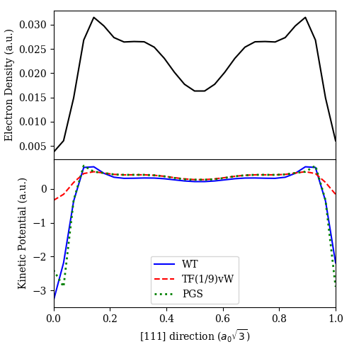
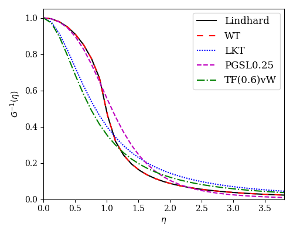

Auto-differentiation Tools
==========================

.. _autodiff_tools_eg:

The following examples show how one can use PROFESS-AD's :doc:`autodifferentiation_tools`.

Functional Derivative Example
-----------------------------

The ``get_functional_derivative()`` function computes the functional derivative of a given functional. 
Consider the following example where we perform a density optimization to get an optimized density and
use it to inspect the functional derivative (or kinetic potential) of some kinetic functionals. ::

  # generate an optimized density to be used
  terms = [IonIon, IonElectron, Hartree, WangTeter, PerdewBurkeErnzerhof]
  box_vecs, frac_ion_coords = get_cell('fcc', vol_per_atom=16.9, coord_type='fractional')
  ions = [['Al', 'al.gga.recpot', frac_ion_coords]]
  shape = System.ecut2shape(3500, box_vecs)
  system = System(box_vecs, shape, ions, terms, units='a', coord_type='fractional')
  system.optimize_density(ntol=1e-10)

  # extract optimized density and lattice vectors (in atomic units)
  den = system.density()
  box_vecs = system.lattice_vectors('b')

  # compute functional derivatives (or kinetic potentials)
  WT_kp = get_functional_derivative(box_vecs, den, WangTeter)

  TFvW = lambda bv, n: ThomasFermi(bv, n) + 1 / 9 * Weizsaecker(bv, n)
  TFvW_kp = get_functional_derivative(box_vecs, den, TFvW)

  pg = PauliGaussian()
  pg.set_PGS()
  PG_kp = get_functional_derivative(box_vecs, den, pg.forward)

  # make plot
  plt.rc('font', family='serif')
  fig, axs = plt.subplots(figsize=(5, 5), nrows=2, sharex=True, gridspec_kw={'hspace': 0})

  r = np.linspace(0, 1, shape[0])
  axs[0].plot(r, [den[i, i, i] for i in range(den.shape[0])], '-k')

  axs[1].plot(r, [WT_kp[i, i, i] for i in range(den.shape[0])], '-b')
  axs[1].plot(r, [TFvW_kp[i, i, i] for i in range(den.shape[0])], '--r')
  axs[1].plot(r, [PG_kp[i, i, i] for i in range(den.shape[0])], ':g', linewidth=2)

  axs[0].set_xlim([0, 1])
  axs[1].set_xlim([0, 1])

  axs[0].set_ylabel('Electron Density (a.u.)')
  axs[1].set_ylabel('Kinetic Potential (a.u.)')
  axs[1].set_xlabel(r'[111] direction ($a_0 \sqrt{3}$)')

  labels = ['WT', 'TF(1/9)vW', 'PGS']
  plt.legend(labels=labels, loc="lower center", borderaxespad=0.4, ncol=1, prop={'size': 10})

  plt.tight_layout()
  plt.show()

This makes the plot

Linear Response Function Example
--------------------------------

The ``get_inv_G()`` function computes the quantity

.. math:: G^{-1}(\eta) = \frac{\pi^2}{k_F} \left(\hat{\mathcal{F}} \left\{\frac{\delta^2 T_\text{S}}
          {\delta n(\mathbf{r})\delta n(\mathbf{r}')} \right\} \Bigg\vert_{n_0, n_0}  \right)^{-1},

given a kinetic functional approximation for :math:`T_\text{S}[n]`. It is known that the non-interacting 
kinetic energy functional must obey the Lindhard linear response for a homogeneous electron gas,

.. math:: G_\text{Lind}^{-1}(\eta) = \frac{1}{2} + \frac{1-\eta^2}{4\eta} \ln{\left|\frac{1+\eta}{1-\eta}\right|}.

A simple application for the ``get_inv_G()`` function is for inspection purposes. ::

  shape = (61, 61, 61)
  box_vecs = 8 * torch.eye(3, dtype=torch.double)
  den = torch.ones(shape, dtype=torch.double)

  plt.rc('font', family='serif')
  plt.subplots(figsize=(4, 3))

  eta, lind = G_inv_lindhard(box_vecs, den)
  plt.plot(eta[0, 0, :], lind[0, 0, :], '-k')

  eta, F = get_inv_G(box_vecs, den, WangTeter)
  plt.plot(eta[0, 0, :], F[0, 0, :], 'r', ls=(0, (5, 5)))

  eta, F = get_inv_G(box_vecs, den, LuoKarasievTrickey)
  plt.plot(eta[0, 0, :], F[0, 0, :], 'b', ls=(0, (1, 1)))

  pg = PauliGaussian()
  pg.set_PGSL025()
  eta, F = get_inv_G(box_vecs, den, pg.forward)
  plt.plot(eta[0, 0, :], F[0, 0, :], '--m')

  eta, F = get_inv_G(box_vecs, den, lambda bv, den: 0.6 * Weizsaecker(bv, den) + ThomasFermi(bv, den))
  plt.plot(eta[0, 0, :], F[0, 0, :], '-.g')

  plt.xlim([0, eta[0, 0, -1]])
  plt.ylim([0, 1.05])

  plt.xlabel(r'$\eta$', fontsize=10)
  plt.ylabel(r'$G^{-1}(\eta)$', fontsize=10)
  plt.xticks(fontsize=10)
  plt.yticks(fontsize=10)

  labels = ['Lindhard', 'WT', 'LKT', 'PGSL0.25', 'TF(0.6)vW']
  plt.legend(labels=labels, loc="upper right", borderaxespad=0.4, ncol=1, prop={'size': 10})

  plt.tight_layout()
  plt.show()

This makes the plot

