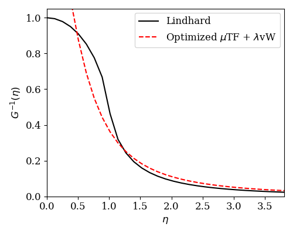
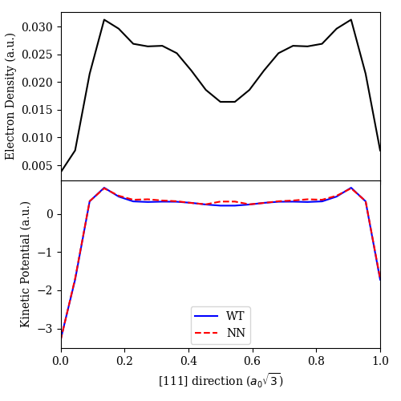

Parameterized Kinetic Functionals
=================================

This example illustrates how we can extend the :ref:`kinetic functional template <kinetic_template>`
class, ``KineticFunctional``, to create parameterized functionals (e.g. neural network functionals),
which can be fitted to data. 

:math:`\mu` TF + :math:`\lambda` vW Functional and Linear Response Fitting
--------------------------------------------------------------------------

Let us start with a simple example to show how the ``KineticFunctional`` class can be used to define 
the :math:`\mu` TF + :math:`\lambda` vW functional. ::

  class TFvW(KineticFunctional):

      def __init__(self, init_args=None):
          super().__init__()
          # init_args is a tuple
          if init_args is None:
              mu, lamb = 1, 1  # defauts to TF + vW
          else:
              mu, lamb = init_args
          # make µ and λ trainable parameters
          self.mu = torch.nn.Parameter(torch.tensor([mu], dtype=torch.double, device=self.device))
          self.lamb = torch.nn.Parameter(torch.tensor([lamb], dtype=torch.double, device=self.device))
          self.initialize()

      def forward(self, box_vecs, den):
          return self.mu * Weizsaecker(box_vecs, den) + self.lamb * ThomasFermi(box_vecs, den)

Now let us use the ``get_inv_G()`` utility function to fit the (:math:`\mu`, :math:`\lambda`) parameters
to reproduce the Lindhard function. (A simpler example of how the ``get_inv_G()`` function can be used can 
be found :ref:`here <autodiff_tools_eg>`.)  ::

  shape = (61, 61, 61)
  box_vecs = 8 * torch.eye(3, dtype=torch.double)
  den = torch.ones(shape, dtype=torch.double)

  # compute Lindhard response function
  eta, G_inv_lind = G_inv_lindhard(box_vecs, den)

  # initialize µ TF + λ vW functional
  TFvW_train = TFvW()
  # set its parameters to have requires_grad = True to make them trainable
  TFvW_train.param_grad(True)

  print('Initial (µ, λ) = ({:.5g}, {:.5g})\n'.format(TFvW_train.mu.item(), TFvW_train.lamb.item()))

  for i in range(20):
      eta, G_inv = get_inv_G(box_vecs, den, TFvW_train.forward, requires_grad=True)
      # computes the loss function and performs optimization to minimize it
      loss = TFvW_train.grid_error(G_inv_lind, G_inv)  # these are inherited helper functions from the
      TFvW_train.update_params(loss)                           # KineticFunctional class to facilitate training
      print('Epoch = {}, Loss = {:.5g}'.format(i, loss.item()))

  TFvW_train.param_grad(False)

  print('\nOptimized (µ, λ) = ({:.5g}, {:.5g})'.format(TFvW_train.mu.item(), TFvW_train.lamb.item()))

  eta, G_inv_opt = get_inv_G(box_vecs, den, TFvW_train.forward)

  # make plot to compare against Lindhard response
  plt.rc('font', family='serif')
  plt.subplots(figsize=(5, 4))

  plt.plot(eta[0, 0, :], G_inv_lind[0, 0, :], '-k')
  plt.plot(eta[0, 0, :], G_inv_opt[0, 0, :], '--r')

  plt.xlim([0, eta[0, 0, -1]])
  plt.ylim([0, 1.05])

  plt.xlabel(r'$\eta$', fontsize=12)
  plt.ylabel(r'$G^{-1}(\eta)$', fontsize=12)
  plt.xticks(fontsize=12)
  plt.yticks(fontsize=12)

  labels = ['Lindhard', r'Optimized $\mu$TF + $\lambda$vW']
  plt.legend(labels=labels, loc="upper right", borderaxespad=0.4, ncol=1, prop={'size': 12})

  plt.tight_layout()
  plt.show()

This results in ::

  Initial (µ, λ) = (1, 1)

  Epoch = 0, Loss = 0.0014799
  Epoch = 1, Loss = 0.0011208
  Epoch = 2, Loss = 0.00074545
  Epoch = 3, Loss = 0.00059983
  Epoch = 4, Loss = 0.00059983
  Epoch = 5, Loss = 0.00060346
  Epoch = 6, Loss = 0.00060346
  Epoch = 7, Loss = 0.00057833
  Epoch = 8, Loss = 0.00056777
  Epoch = 9, Loss = 0.00056521
  Epoch = 10, Loss = 0.00056278
  Epoch = 11, Loss = 0.0005615
  Epoch = 12, Loss = 0.00056022
  Epoch = 13, Loss = 0.00056301
  Epoch = 14, Loss = 0.00056301
  Epoch = 15, Loss = 0.0005608
  Epoch = 16, Loss = 0.0005603
  Epoch = 17, Loss = 0.0005603
  Epoch = 18, Loss = 0.00056026
  Epoch = 19, Loss = 0.00056026

  Optimized (µ, λ) = (0.70015, 0.60223)

and makes the plot

Neural Network Functional and Kinetic Potential Fitting
-------------------------------------------------------

Let us now consider how the ``KineticFunctional`` class can be used to define a toy neural network
functional. We use a simple Laplacian-level semi-local functional of the form

.. math:: T_\text{S}[n] = T_\text{vW}[n] + \int_\Omega d^3\mathbf{r}~F_\text{enh}(s,q) \tau_\text{TF}(\mathbf{r})

where :math:`T_\text{vW}` is the :ref:`von Weizsaecker functional <vw>`, :math:`\tau_\text{TF}(\mathbf{r})` is 
the :ref:`Thomas-Fermi <tf>` kinetic energy density, :math:`s` is the :ref:`reduced gradient <s>` and 
:math:`q` is the :ref:`reduced Laplacian <q>`. We shall use a neural network to approximate the Pauli enhancement
factor, :math:`F_\text{enh}(s,q)`. ::

  class NeuralNetworkFunctional(KineticFunctional):

      def __init__(self, inner_layer_sizes):

          super().__init__()
          self.init_args = inner_layer_sizes
          layer_sizes = [2] + self.init_args + [1]

          self.nn = torch.nn.Sequential()
          for i in range(len(layer_sizes) - 1):
              self.nn.add_module('Linear_{}'.format(i), torch.nn.Linear(layer_sizes[i], layer_sizes[i + 1],
                                 dtype=torch.double))
              if i != len(layer_sizes) - 2:
                  self.nn.add_module('Activation_{}'.format(i), torch.nn.SiLU())
          self.nn.add_module('Activation_-1', torch.nn.Softplus())
          self.initialize()

      def forward(self, box_vecs, den):
          # getting descriptors
          kxyz = wavevectors(box_vecs, den.shape)
          s = reduced_gradient(kxyz, den)
          q = reduced_laplacian(kxyz.square().sum(-1), den)

          # compute Pauli enhancement factor
          Fenh = torch.squeeze(self.nn(torch.cat((s.unsqueeze(-1), q.unsqueeze(-1)), dim=-1)))

          # assembling the terms
          vol = torch.abs(torch.linalg.det(box_vecs))
          TF_ked = 0.3 * (3 * np.pi * np.pi)**(2 / 3) * den.pow(5 / 3)
          Pauli_T = torch.mean(Fenh * TF_ked) * vol
          return Weizsaecker(box_vecs, den) + Pauli_T

We now give an example of how the ``get_functional_derivative()`` utility function can be used to facilitate 
the fitting of this neural network functional's functional derivative (or kinetic potential) to some reference
kinetic potential. (A simpler example of how the ``get_functional_derivative()`` function can be used can be 
found :ref:`here <autodiff_tools_eg>`.) As this is just a toy model to illustrate how one might use PROFESS-AD's 
utilities for such training, we shall fit the neural network functional's kinetic potential to that of the 
Wang-Teter functional's for a face-centred cubic (fcc) aluminium system, where the density was optimized using 
the Wang-Teter functional. Of course, this is just a toy example to explain how PROFESS-AD can be used for such
training - it is uncertain if the model trained is transferable enough to be used for density optimizations due 
to overfitting on a single example. ::

  # generate an optimized density to be used
  terms = [IonIon, IonElectron, Hartree, WangTeter, PerdewBurkeErnzerhof]
  box_vecs, frac_ion_coords = get_cell('fcc', vol_per_atom=16.9, coord_type='fractional')
  ions = [['Al', 'al.gga.recpot', frac_ion_coords]]
  shape = System.ecut2shape(2000, box_vecs)
  system = System(box_vecs, shape, ions, terms, units='a', coord_type='fractional')
  system.optimize_density(ntol=1e-10)

  # extract optimized density and lattice vectors (in atomic units)
  den = system.density()
  box_vecs = system.lattice_vectors('b')

  # as a toy example, let's try to fit the neural network functional's kinetic potential
  # to that of the Wang-Teter functional for this optimized density

  # the "target"
  WT_kp = get_functional_derivative(box_vecs, den, WangTeter)

  # create the neural network functional with 3 hidden layers having 8 nodes each
  model = NeuralNetworkFunctional([8, 8, 8])

  # explicitly defining the optimizer and its parameters
  model.optimizer = torch.optim.Rprop(model.parameters(), lr=0.01, step_sizes=(1e-8, 50))

  model.param_grad(True)

  for iter in range(201):
      NN_kp = get_functional_derivative(box_vecs, den, model.forward, requires_grad=True)
      loss = model.grid_error(WT_kp, NN_kp)
      model.update_params(loss)
      if iter % 20 == 0:
          print('Iteration {}, RMSE = {:.5g}'.format(iter, torch.sqrt(loss).item()))

  model.param_grad(False)

  NN_kp = get_functional_derivative(box_vecs, den, model.forward)

  # make plot
  plt.rc('font', family='serif')
  fig, axs = plt.subplots(figsize=(5, 5), nrows=2, sharex=True, gridspec_kw={'hspace': 0})

  r = np.linspace(0, 1, shape[0])
  axs[0].plot(r, [den[i, i, i] for i in range(den.shape[0])], '-k')

  axs[1].plot(r, [WT_kp[i, i, i] for i in range(den.shape[0])], '-b')
  axs[1].plot(r, [NN_kp[i, i, i] for i in range(den.shape[0])], '--r')

  axs[0].set_xlim([0, 1])
  axs[1].set_xlim([0, 1])

  axs[0].set_ylabel('Electron Density (a.u.)')
  axs[1].set_ylabel('Kinetic Potential (a.u.)')
  axs[1].set_xlabel(r'[111] direction ($a_0 \sqrt{3}$)')

  labels = ['WT', 'NN']
  plt.legend(labels=labels, loc="lower center", borderaxespad=0.4, ncol=1, prop={'size': 10})

  plt.tight_layout()
  plt.show()

This results in ::

  Iteration 0, RMSE = 0.1618
  Iteration 20, RMSE = 0.05397
  Iteration 40, RMSE = 0.029365
  Iteration 60, RMSE = 0.022676
  Iteration 80, RMSE = 0.021627
  Iteration 100, RMSE = 0.020801
  Iteration 120, RMSE = 0.020157
  Iteration 140, RMSE = 0.019637
  Iteration 160, RMSE = 0.01925
  Iteration 180, RMSE = 0.018822
  Iteration 200, RMSE = 0.018475
  
and makes the plot

As the neural network parameters are initialized randomly, running the above code may lead to different 
results each time.
